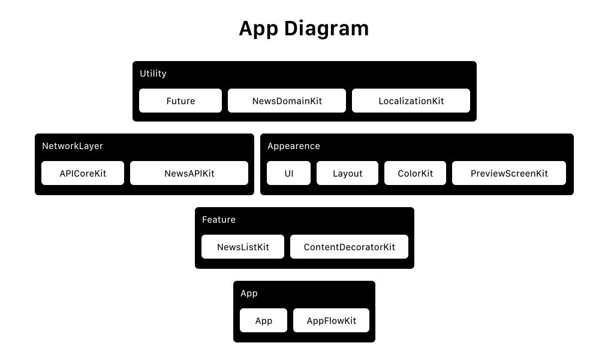

# New York Times Reader 📱

## Requirements

- [x] XCode 11.x

## Demo

## Features

- [x] landscape and portrait orientation,
- [x] supporting devices greater than iOS 12,
- [x] screen previews,
- [x] swift package manager,
- [x] handles internet failure, and stores executed request result,
- [x] implemented emailed, shared and viewed tabs, as proposed in test.

## Building and runnning

In order to execute the app you need to do the following steps:

- open new-york-times-ios.xcworkspace,
- execute scheme App.

## Introduction

The diagram shows how the app was built, the architecture focused on modularity, was decided to separate in five projects, *feature*, *utilities*, *network layer*, *appearence* and *app*. 

The decision was for maximize the hability to reuse code and make fast choices, by doing it you can build entire app and plug whatever you want. 

The project has a name that associate with a responsability and the module inside has the implementation, for example, *feature* has this name because each module is a specific feature, there's *NewsListKit*, it's a module that has the list of news, and if you want to plug in a context, you can do it really quick without been tied to some other implementations, that's the power of SOLID.

## Main concepts

- The app used SOLID concepts, which means the decision to prefer modularity, is also some concepts that requires isolation and single responsability.
- Also the achitecture used Design Pattern for standard implementations, that for eg are factories and adapters.

## Modules

Here will be explained each project and the modules inside and what they are responsible for.

- [App](/App/README.md)
- [Appearence](/Appearence/README.md)
- [Feature](/Feature/README.md)
- [NetworkLayer](/NetworkLayer/README.md)
- [Utilities](/Utilities/README.md)
